# KodBank — Project Architecture & Technical Overview

> A personal finance web application with AI chat, account management, live news, and stock analytics.

---

## 1. What is KodBank?

KodBank is a full-stack web application built entirely on **Python (Flask)** for the backend and **vanilla HTML/CSS/JavaScript** for the frontend. It combines four tools into a single dashboard:

| Feature | Description |
|---|---|
| 💬 **AI Chat** | GPT-4o powered financial assistant, context-aware via RAG |
| 📊 **Dashboard** | Live account balance and transaction history from MySQL |
| 📰 **News** | Real-time financial headlines via NewsAPI (4 categories) |
| 📈 **Stock Analytics** | Technical indicators + interactive charts from Yahoo Finance |

---

## 2. High-Level Architecture

```mermaid
graph TD
    User["🌐 User Browser"]

    subgraph Render["☁️ Render.com (Cloud Host)"]
        Gunicorn["⚙️ Gunicorn WSGI Server"]
        Flask["🐍 Flask app.py"]
        Scraper["📉 scraper.py"]
        RAG["🧠 rag.py - TF-IDF RAG"]
    end

    subgraph External["🌍 External Services"]
        GPT["🤖 GitHub Models - GPT-4o"]
        News["📰 NewsAPI"]
        Yahoo["📊 Yahoo Finance"]
        DB["🗄️ MySQL - Aiven Cloud"]
    end

    User -->|"HTTP Request"| Gunicorn
    Gunicorn --> Flask
    Flask -->|"Chat message"| RAG
    RAG -->|"Enriched system prompt"| GPT
    GPT -->|"AI response"| Flask
    Flask -->|"Ticker request"| Scraper
    Scraper -->|"Scrape HTML"| Yahoo
    Flask -->|"News fetch"| News
    Flask -->|"Auth / Balance / Transactions"| DB
    Flask -->|"HTML / JSON"| Gunicorn
    Gunicorn -->|"Response"| User
```



---

## 3. Project File Structure

```
Kod-Bank/
│
├── .gitignore                  ← Excludes venv/, .env, __pycache__
│
└── server/                     ← Entire application lives here
    ├── app.py                  ← Flask routes, startup, business logic
    ├── scraper.py              ← Yahoo Finance scraper + indicators
    ├── rag.py                  ← TF-IDF retriever for AI context
    ├── combined_tickers.json   ← 20,000+ NSE & US stock symbols
    ├── requirements.txt        ← Python dependencies
    ├── Procfile                ← Render/Railway start command
    ├── schema.sql              ← MySQL table definitions
    ├── .env                    ← Secret keys (local only, NOT in git)
    ├── .env.example            ← Template showing required keys
    │
    ├── templates/
    │   ├── base.html           ← Shared HTML head, scripts, toast
    │   ├── dashboard.html      ← Main app UI (all 4 tabs)
    │   ├── login.html
    │   └── register.html
    │
    └── static/
        └── (CSS, images)
```

---

## 4. Tech Stack

| Layer | Technology | Purpose |
|---|---|---|
| Web Framework | **Flask 3.x** (Python) | Routes, sessions, API endpoints |
| Database | **MySQL** on Aiven Cloud | Users, balances, transactions |
| AI Model | **GPT-4o** via GitHub Models | Answers financial questions |
| AI Context | **scikit-learn TF-IDF** | RAG retrieval for relevant context |
| News | **NewsAPI** | Live financial headlines |
| Stock Data | **Yahoo Finance** (scraped) | Historical OHLCV price data |
| Indicators | **pandas** | RSI, Bollinger Bands, MA, MACD |
| Charts | **ApexCharts** (JS CDN) | Candlestick + area line charts |
| Icons | **Lucide Icons** (JS CDN) | Sidebar and UI icons |
| Fonts | **Inter** (Google Fonts) | Premium typography |
| Production Server | **Gunicorn** | WSGI server wrapping Flask |
| Cloud Host | **Render.com** | Persistent Python web service |

---

## 5. Database Schema


---

## 6. Request Flow — Chat with RAG


**What the system prompt looks like:**
```
You are KodBank AI, a helpful financial assistant...

--- Relevant context from KodBank knowledge base:
• RSI (Relative Strength Index): Range 0–100. Above 70 = overbought.
  Below 30 = oversold. Between 30–70 is neutral.
• Moving Averages: Golden Cross = SMA50 crosses above SMA200 (bullish)...
• [3rd relevant chunk...]
```

---

## 7. Request Flow — Stock Analytics

```mermaid
sequenceDiagram
    participant B as Browser
    participant F as Flask /api/analytics/stock/<ticker>
    participant S as scraper.py
    participant Y as Yahoo Finance

    B->>F: GET /api/analytics/stock/TCS
    F->>S: fetch_stock_history("TCS")
    S->>Y: HTTP GET finance.yahoo.com/quote/TCS/history
    Y-->>S: HTML page with price table
    S->>S: BeautifulSoup parse → OHLCV rows
    S-->>F: list of 100+ daily rows
    F->>S: calculate_summary_statistics(history)
    S->>S: pandas → RSI, BB, SMA, EMA, MACD
    S-->>F: statistics dict
    F-->>B: { ticker, history[], statistics{} }
    B->>B: Render ApexCharts candlestick/line chart
```



---

## 8. RAG System — How It Works


| When | What happens |
|---|---|
| **App startup** | User guide split into 96 chunks, TF-IDF index built |
| **News tab opened** | Article titles + descriptions added to index (background thread) |
| **Every chat message** | Top 3 chunks retrieved and injected into system prompt |

---

## 9. Frontend Architecture

The entire UI is a **single HTML file** ([dashboard.html](file:///c:/Users/Admin/Documents/github/Kod-Bank/server/templates/dashboard.html)) using vanilla JavaScript. No React, no Vue — just DOM manipulation and [fetch()](file:///c:/Users/Admin/Documents/github/Kod-Bank/server/templates/dashboard.html#821-838) API calls.

```mermaid
graph LR
    Sidebar["🗂️ Sidebar Nav\n4 buttons"]
    switchView["switchView()"]
    ChatView["💬 Chat View"]
    DashView["📊 Dashboard View"]
    NewsView["📰 News View"]
    AnalyticsView["📈 Analytics View"]
    ApexCharts["📊 ApexCharts\nCandlestick / Line"]

    Sidebar --> switchView
    switchView --> ChatView
    switchView --> DashView
    switchView --> NewsView
    switchView --> AnalyticsView
    AnalyticsView --> ApexCharts
```



**Key JS functions:**

| Function | Purpose |
|---|---|
| [switchView(view)](file:///c:/Users/Admin/Documents/github/Kod-Bank/server/templates/dashboard.html#787-807) | Shows/hides the correct tab panel |
| [analyzeStock()](file:///c:/Users/Admin/Documents/github/Kod-Bank/server/templates/dashboard.html#1137-1157) | Fetches stock data and renders dashboard + chart |
| [renderAnalyticsChart(history, type)](file:///c:/Users/Admin/Documents/github/Kod-Bank/server/templates/dashboard.html#1239-1301) | Builds ApexCharts candlestick or area chart |
| [loadAnalyticsTickers()](file:///c:/Users/Admin/Documents/github/Kod-Bank/server/templates/dashboard.html#1065-1074) | Loads 20K+ tickers for autocomplete search |
| [loadNews(category)](file:///c:/Users/Admin/Documents/github/Kod-Bank/server/templates/dashboard.html#1324-1392) | Fetches and renders news cards with skeleton loading |
| [get_context()](file:///c:/Users/Admin/Documents/github/Kod-Bank/server/rag.py#182-192) in rag.py | Retrieves relevant chunks for chat context |

---

## 10. Authentication & Security

```mermaid
flowchart TD
    Register["POST /api/auth/register\nHash password → MySQL"]
    Login["POST /api/auth/login\nVerify hash → Set session cookie"]
    Protected["Protected routes\n/api/user/* /api/chat /api/news"]
    Check{"session has\n'user_id'?"}
    Allow["✅ Allow request"]
    Deny["❌ 401 Unauthorized"]

    Register --> Login
    Login --> Protected
    Protected --> Check
    Check -->|Yes| Allow
    Check -->|No| Deny
```



**Security practices:**
- Passwords hashed with Flask-Bcrypt (not stored in plain text)
- Sessions expire after **1 hour**
- API keys loaded **only from environment variables** — never hardcoded
- [.env](file:///c:/Users/Admin/Documents/github/Kod-Bank/server/.env) excluded from git via [.gitignore](file:///c:/Users/Admin/Documents/github/Kod-Bank/.gitignore)
- Production uses Render's secure env var vault

---

## 11. Environment Variables

| Variable | Used by | Where to get it |
|---|---|---|
| `FLASK_SECRET_KEY` | Flask session signing | Any random string |
| `GITHUB_TOKEN` | GPT-4o via GitHub Models | github.com/settings/tokens |
| `NEWS_API_KEY` | NewsAPI | newsapi.org |
| `DB_HOST` | MySQL connection | Aiven dashboard |
| `DB_USER` | MySQL connection | Aiven dashboard |
| `DB_PASSWORD` | MySQL connection | Aiven dashboard |
| `DB_NAME` | MySQL connection | Aiven dashboard |
| `DB_PORT` | MySQL connection | Aiven dashboard |

---

## 12. Deployment on Render

```mermaid
flowchart LR
    GH["GitHub\nKod-Bank repo"]
    Render["Render.com\nWeb Service"]
    Build["pip install -r requirements.txt"]
    Start["gunicorn app:app\n--timeout 120 --workers 1"]
    Live["🌐 Live URL\nyour-app.onrender.com"]

    GH -->|"Auto-deploy on push"| Render
    Render --> Build
    Build --> Start
    Start --> Live
```



**Render Settings:**

| Field | Value |
|---|---|
| Root Directory | `server` |
| Build Command | `pip install -r requirements.txt` |
| Start Command | `gunicorn app:app --timeout 120 --workers 1` |
| Runtime | Python 3 |
| Instance Type | Free (or Starter for always-on) |

---

*KodBank — Built with Flask, powered by GPT-4o, deployed on Render.*
